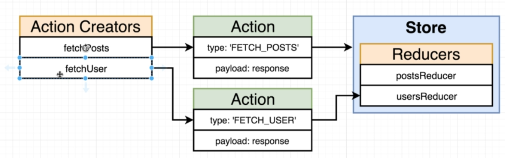

# Redux Thunk

# Middleware

There are two types of action creators synchronous(instantly returns an action with the data) and asynchronous(takes some time to load and prepare the data) action creators
In order to have async action creators we need to have a middleware

After dispatching an action rather than sending it to a reducer directly we send it to a middleware first in order to make async requests work in javascript

We are using a middleware known as `redux-thunk` in order to help us with async requests.
With `redux-thunk` we can return a function as well from an action creator rather than to return action objects.

# Reducers Rules

**Only relevent to the state object in reducers**

# Action creator

We are following such a approach of only getting that user data whose post it is since if the app scales to say a million users we won't be getting a list of million users everytime a request is made to the backend rather that particular user info only

